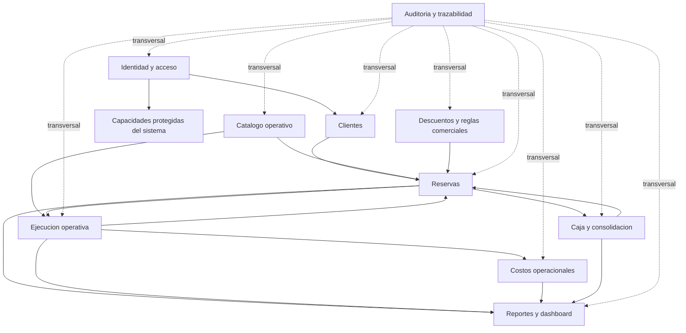

# Context Map - Travesia Natural

## 1. Objetivo

Este documento presenta el **Context Map** de Travesia Natural a partir del analisis funcional disponible. Su objetivo es mostrar:

- que contextos existen
- como se relacionan
- que contexto consume informacion de otro
- que contexto es responsable principal de determinados datos

Este documento describe relaciones de dominio. No define todavia APIs, contratos tecnicos, tablas de base de datos ni mecanismos de integracion.

## 2. Bounded Contexts identificados

Los contextos delimitados considerados para el mapa son:

1. Clientes
2. Identidad y acceso
3. Reservas
4. Catalogo operativo
5. Descuentos y reglas comerciales
6. Ejecucion operativa
7. Costos operacionales
8. Caja y consolidacion

Capacidades relacionadas no tratadas como bounded contexts plenos en esta etapa:

1. Reportes y dashboard
2. Auditoria y trazabilidad

## 3. Context Map visual



```text
Resumen lineal del mapa:

Identidad y acceso -> Clientes
Identidad y acceso -> Capacidades protegidas del sistema
Clientes -> Reservas
Catalogo operativo -> Reservas
Catalogo operativo -> Ejecucion operativa
Descuentos y reglas comerciales -> Reservas
Reservas <-> Ejecucion operativa
Ejecucion operativa -> Costos operacionales
Reservas <-> Caja y consolidacion
Reservas -> Reportes y dashboard
Ejecucion operativa -> Reportes y dashboard
Costos operacionales -> Reportes y dashboard
Caja y consolidacion -> Reportes y dashboard
Auditoria y trazabilidad -> transversal a todos los contextos
```

La tabla de relaciones de la seccion 4 debe considerarse la fuente de verdad semantica del mapa.

## 4. Relaciones entre contextos

| Origen | Destino | Relacion funcional |
| --- | --- | --- |
| Clientes | Reservas | La reserva identifica y utiliza informacion del cliente titular y de los acompanantes. |
| Identidad y acceso | Clientes | La autenticacion del cliente final y la habilitacion de acceso sobre sus reservas requieren referenciar la identidad de una persona del dominio sin convertir a Identidad en owner de sus datos comerciales u operativos. |
| Identidad y acceso | Capacidades protegidas del sistema | Proporciona autenticacion y control de acceso segun los permisos definidos. |
| Catalogo operativo | Reservas | La reserva utiliza la oferta disponible de atractivos, hospedaje, alimentacion, transporte, capacidad parametrizada y costos catalogados necesarios para calcular y validar la venta. |
| Catalogo operativo | Ejecucion operativa | La ejecucion utiliza informacion base operativa y costos catalogados como referencia para registrar lo efectivamente prestado sin reemplazar los datos reales de la operacion. |
| Descuentos y reglas comerciales | Reservas | La reserva utiliza reglas de descuento para calcular y confirmar valores comerciales. |
| Reservas | Ejecucion operativa | La ejecucion se origina a partir de una reserva valida y conserva trazabilidad con ella. |
| Ejecucion operativa | Reservas | La ejecucion debe conservar referencia a la reserva de origen para trazabilidad, consulta y control de diferencias entre lo reservado y lo efectivamente prestado. |
| Ejecucion operativa | Costos operacionales | Los costos operacionales derivan de lo efectivamente ejecutado y de la cantidad real atendida. |
| Reservas | Caja y consolidacion | La reserva aporta informacion comercial, estado de pago y modalidad seleccionada que pueden dar origen a movimientos monetarios posteriores sin transferir ownership del movimiento de caja. |
| Caja y consolidacion | Reservas | Los movimientos monetarios efectivos asociados a una reserva pueden ser consumidos por Reservas como evidencia para confirmar o actualizar el estado de pago, sin transferir ownership del movimiento de caja. |
| Caja y consolidacion | Reportes y dashboard | La informacion financiera consolidada es consumida para consulta operativa y administrativa. |
| Reservas | Reportes y dashboard | Las reservas alimentan consultas comerciales, operativas y de seguimiento. |
| Ejecucion operativa | Reportes y dashboard | La ejecucion aporta informacion real de prestacion y novedades para consulta. |
| Costos operacionales | Reportes y dashboard | Los costos aportan informacion derivada para control y analisis interno. |
| Todos los contextos | Auditoria y trazabilidad | Cada contexto genera evidencia de las operaciones relevantes de su propio dominio. |

## 5. Ownership principal de informacion

| Contexto | Datos o informacion bajo su responsabilidad principal |
| --- | --- |
| Clientes | Informacion maestra de personas del dominio, incluyendo cliente titular y acompanantes, datos de contacto, datos sensibles o de emergencia, consentimientos o aceptaciones funcionales y evidencias relacionadas |
| Identidad y acceso | Credenciales, autenticacion, acceso y permisos base |
| Reservas | Informacion comercial de la reserva, estados, valores proyectados, valor final de cobro, descuentos aplicados, modalidad seleccionada, estado de pago, disponibilidad comercial temporal y vinculacion de acompanantes a la reserva |
| Catalogo operativo | Informacion base de atractivos, hospedaje, alimentacion, transporte, capacidad parametrizada, vigencia comercial y costos catalogados reutilizables |
| Descuentos y reglas comerciales | Configuracion de descuentos, vigencia, prioridad, topes y reglas de aplicacion |
| Ejecucion operativa | Informacion real de la prestacion, servicios prestados, no prestados y causales |
| Costos operacionales | Costos derivados de la ejecucion real y gastos operacionales asociados |
| Caja y consolidacion | Apertura, cierre, ingresos, pagos, gastos, historico, correcciones excepcionales y consolidacion mensual |
| Reportes y dashboard | Informacion derivada para consulta operativa y administrativa |
| Auditoria y trazabilidad | Evidencias de operaciones relevantes registradas por cada contexto |

## 6. Lectura del mapa

El mapa debe interpretarse con los siguientes criterios:

- `Clientes` y `Identidad y acceso` son contextos distintos: uno administra informacion de personas y el otro seguridad.
- `Reservas` es el nucleo comercial y concentra estados de reserva, disponibilidad temporal, acompanantes vinculados y estado de pago.
- `Catalogo operativo` provee informacion base para venta y operacion, pero no es owner de hechos transaccionales.
- `Ejecucion operativa` representa lo efectivamente prestado y no debe confundirse con la proyeccion comercial de `Reservas`.
- `Costos operacionales` nacen de la ejecucion real.
- `Caja y consolidacion` es owner de los movimientos monetarios efectivos, no del valor comercial de la reserva.
- `Reportes y dashboard` consumen informacion derivada y no deben convertirse en owner de datos operacionales.
- `Auditoria y trazabilidad` es transversal a todos los contextos.

## 7. Observaciones

- Este Context Map es apto para la **Sesion 2** como entregable de relaciones entre bounded contexts.
- El mapa no obliga todavia a usar microservicios.
- Las decisiones de arquitectura fisica, integracion, persistencia y despliegue deben resolverse en el ADR.
