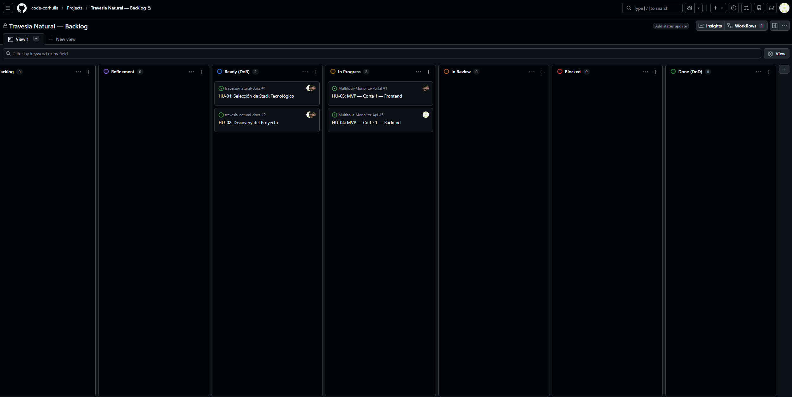

# Sesion 2 - Cierre del sprint MVP1

## Alcance de MVP 1

Flujo minimo: **un cliente ve el catalogo, crea una reserva y la paga**. Tomado
directamente de lo que ya existe en el Backend (indiferente de que hoy el repo tenga
mucho mas contenido implementado - este corte es solo el subconjunto que define el
MVP1).

## Compromiso MoSCoW

| Prioridad | Spec | Contenido |
|---|---|---|
| **Must have** | 001 - Walking skeleton | `/health`, layout hexagonal, `Reservation` persistida contra Postgres real |
| **Must have** | 002 - Tenant lifecycle | Alta de tenant (`POST /api/tenants`), base para que exista un `tenantId` valido |
| **Must have** | 005 - Catalog item management | `GET /api/tenants/{tenantId}/catalog-items` (listar y ver detalle) |
| **Must have** | 006 - Reservation query | `GET .../reservations`, `GET .../reservations/{id}` |
| **Must have** | 007 - JWT enforcement | Login (`POST .../login`) y JWT obligatorio en creacion y consulta de reservas propias |
| **Must have** | 009 - Reservation payment | `POST .../reservations/{id}/payments` |
| Should have | 008 - Discount management | Aplicar descuento a una reserva ya creada |
| Should have | 010, 011, 012 | Ejecucion/costos operativos, cancelacion, reembolso |
| Could have | 013, 014, 015, 016 | Caja diaria, colaboradores operativos, transporte en catalogo, aislamiento por cliente |
| Won't have (este sprint) | 017 a 025 | Finalizacion de ejecucion, acompanantes, ciclo de vida de solicitudes de reembolso, permisos de soporte, trazabilidad de auditoria, modificacion de reserva, transporte en reserva, establecimientos asociados |

El contrato completo del corte Must have esta en
[`MVP1-Contrato-API-openapi.yaml`](./MVP1-Contrato-API-openapi.yaml).

## Historias pequenas con criterios de aceptacion testeables

| Historia | Criterio de aceptacion |
|---|---|
| Como cliente final, quiero autenticarme con email y password | Login valido devuelve `accessToken`; login invalido devuelve `401` sin distinguir la causa (spec 004/007) |
| Como cliente final, quiero ver el catalogo de un tenant | `GET .../catalog-items` devuelve solo items del tenant indicado en la URL |
| Como cliente final, quiero crear una reserva con al menos un servicio | `POST .../reservations` con JWT valido devuelve `201` y la reserva queda en Postgres con `reservationStatus = Pendiente de pago`; sin servicios reservados devuelve `400` sin persistir nada |
| Como cliente final, quiero consultar mis propias reservas | `GET .../reservations/me` devuelve solo reservas del `membershipId` del JWT, nunca de otro tenant (spec 016) |
| Como cliente final, quiero registrar un pago sobre mi reserva | `POST .../reservations/{id}/payments` actualiza `paymentStatus`; un pago ya resuelto devuelve `409` |

## Tablero de tareas

El tablero real ("Travesia Natural - Backlog") usa columnas Backlog / Refinement /
Ready (DoR) / In Progress / In Review / Blocked / Done (DoD), y hoy trackea el trabajo a
nivel de epica (vinculada a issues de cada repo), no al nivel de historia individual:

| Columna | Item | Vinculado a |
|---|---|---|
| Ready (DoR) | HU-01: Seleccion de Stack Tecnologico | `travesia-natural-docs #1` |
| Ready (DoR) | HU-02: Discovery del Proyecto | `travesia-natural-docs #2` |
| In Progress | HU-03: MVP - Corte 1 - Frontend | `Multitour-Monolito-Portal #1` |
| In Progress | HU-04: MVP - Corte 1 - Backend | `Multitour-Monolito-Api #5` |

`HU-04: MVP - Corte 1 - Backend` es la epica que agrupa el Must-have de la tabla MoSCoW
de arriba; las 5 historias pequenas con criterio de aceptacion testeable de la seccion
anterior son el desglose de esa epica a nivel de story, que hoy vive en las specs del
repo Backend (`specs/001`, `002`, `005`, `006`, `007`, `009`) en vez de como issues
individuales en este tablero.

## Definition of Done

Se reutiliza el DoD ya vigente para el proyecto, definido en el repo Docs:
[`00-governance/definition-of-done.md`](https://github.com/code-corhuila/travesia-natural-docs/blob/main/00-governance/definition-of-done.md)
(autoria de Fernanda Robayo - documento de gobernanza compartido, no se modifica aqui,
solo se referencia como criterio de cierre para las historias de este sprint).

## Siguiente sprint

Con el walking skeleton (Sesion 1) y este contrato Must-have ya construidos, el "MVP 1"
queda listo para su entrega. El resto del backlog (Should/Could/Won't de esta tabla)
se planifica en sprints posteriores.
