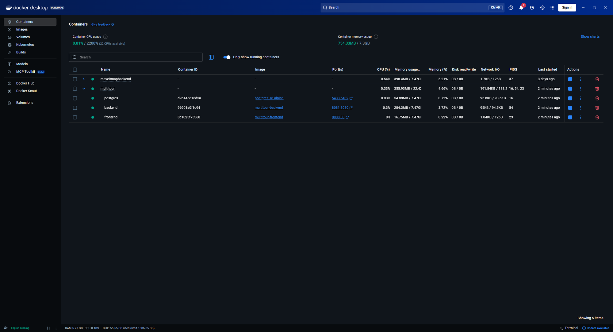

# Sesion 1 - Containerizacion de los servicios (base runtime del MVP1)

## Objetivo de la sesion

Containerizar Backend y Frontend con Dockerfile multi-stage cada uno, un
`.dockerignore`, y un `docker-compose.yml` que levante los tres servicios
(Backend, Frontend, Postgres) en una sola red, con configuracion por variables
de entorno y los datos de Postgres en un volumen. Esta base de runtime es la
que sostiene el release de MVP1 de la Sesion 2.

## Que se implemento

### Backend (`Repositorio Monolito/Backend`)

- **`Dockerfile`** multi-stage:
  - Etapa build: `maven:3.9.9-eclipse-temurin-21` (misma version de Maven que
    `.mvn/wrapper/maven-wrapper.properties`), corre `mvn package -DskipTests`.
  - Etapa runtime: `eclipse-temurin:21-jre-alpine`, solo copia el jar
    resultante (`app.jar`), expone `8080`.
- **`.dockerignore`**: excluye `target/`, `.git`, `specs/`, `*.md`, `.env`,
  entre otros, para no meter artefactos de build ni secretos en el contexto.
- **`.env.example`**: documenta las variables de entorno esperadas
  (`POSTGRES_DB`, `POSTGRES_USER`, `POSTGRES_PASSWORD`, `APP_JWT_SECRET`);
  `.env` (con los valores reales) queda en `.gitignore`, siguiendo el mismo
  patron que ya existia para `APP_JWT_SECRET` en `application.properties`.

### Frontend (`Repositorio Monolito/Frontend`)

Ya estaba containerizado (Dockerfile multi-stage Node build + Nginx runtime,
`.dockerignore`, `docker-compose.yml` propio) por la companera de equipo,
Fernanda Robayo - no se modifico nada de ese repo (autoria ajena, regla 11 de
`CLAUDE.md`). El `docker-compose.yml` del Backend reutiliza ese `Dockerfile`
como `build.context` apuntando a `../Frontend`.

### Orquestacion (`Repositorio Monolito/Backend/docker-compose.yml`)

Se extendio el `docker-compose.yml` que ya existia (usado desde la Sesion 1 de
la Semana 04 solo para Postgres) para agregar `backend` y `frontend`, los tres
en una red compartida (`multitour-net`):

| Servicio | Imagen/Build | Puerto host | Depende de |
|---|---|---|---|
| `postgres` | `postgres:16-alpine` | `5433` | - |
| `backend` | build local (`./Dockerfile`) | `8081` | `postgres` (espera `service_healthy`) |
| `frontend` | build local (`../Frontend/Dockerfile`) | `8080` | `backend` |

Configuracion via entorno (`SPRING_DATASOURCE_URL`, `SPRING_DATASOURCE_USERNAME`,
`SPRING_DATASOURCE_PASSWORD`, `APP_JWT_SECRET`, `POSTGRES_*`), con valores por
defecto de desarrollo via sintaxis `${VAR:-default}`. Los datos de Postgres
persisten en el volumen nombrado `multitour-postgres-data`, ya existente desde
la Sesion 1 de la Semana 04.

## Evidencia de ejecucion



Los tres contenedores quedan agrupados bajo el proyecto Compose `multitour`
(clave `name: multitour` en `docker-compose.yml`, en vez del nombre por
defecto `backend` derivado de la carpeta) - `postgres`, `backend` y
`frontend` corriendo juntos, con sus imagenes `multitour-backend` y
`multitour-frontend`.

```
$ docker compose build
...
backend-backend    Built
backend-frontend   Built

$ docker compose up -d
Network backend_multitour-net  Created
Container multitour-postgres   Started
Container multitour-postgres   Healthy
Container multitour-backend    Started
Container multitour-frontend   Started

$ docker compose ps
NAME                 IMAGE                SERVICE    STATUS
multitour-backend    backend-backend      backend    Up (healthy dependency)
multitour-frontend   backend-frontend     frontend   Up
multitour-postgres   postgres:16-alpine   postgres   Up (healthy)

$ curl http://localhost:8081/health
{"status":"UP"}

$ curl -o /dev/null -w "%{http_code}" http://localhost:8080
200
```

Los tres contenedores quedan arriba juntos en una sola invocacion de
`docker compose up`, el Backend responde `/health` conectado a Postgres real
(no mockeado), y el Frontend sirve su build estatico via Nginx.

## Nota de reconciliacion

`docker-compose.yml` ya existia desde la Spec 001 (Semana 04, walking
skeleton) solo con el servicio `postgres`. Esta sesion no lo reemplaza: lo
extiende agregando `backend` y `frontend` sobre la misma red y el mismo
volumen de datos.
