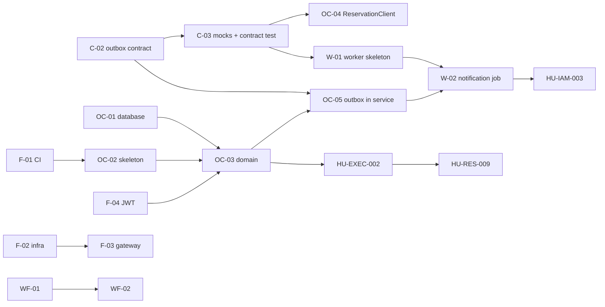

# Session 2 - Story map, planning poker, cross-service dependencies and the MVP 2 commitment

## Objective

Build a story map of the product, estimate the MVP 2 stories with planning poker, map and
sequence the cross-service dependencies (contract-first, with mocks), and commit an MVP 2
scope that is realistic against the velocity and the sprint goal.

## 0. How to read this document

- **The planning poker was a single-estimator round, not a team session.** One person
  estimated every story; there was no second voter and no discussion round.
- **The velocity is provisional and low confidence** (section 3). No sprint has ever
  closed with points, so it is rebuilt from the week 08 work, estimated after the fact.
- **The team is two people** (backend, infrastructure and workers on one side; the
  interface on the other, owned by a teammate). Hours per person are not recorded, so
  capacity is expressed only through the provisional velocity.
- **The MVP 2 cutoff date is not recorded in the repository.** The plan therefore says how
  many sprints the scope needs, and does not claim it fits a date.
- **This plan follows the current ADR-004** (revised 2026-09-27): services talk over HTTP,
  each writes its events to an outbox table, and the worker reads them; **there is no
  message broker in this phase**. The week 07 documents assumed a broker and topics; where
  they differ, this document wins (section 6).
- Sources: `05-architecture/decisions/records/ADR-004`, `ADR-005`, `ADR-006` and
  `07-api/contracts/openapi/` in the Docs repository (all on `main` as of 2026-09-28,
  except the open PRs #55 to #57), the repository norm annexes in `Data/Document/`, and
  the Sprint 08 board (https://github.com/users/Molina211/projects/3).

## 1. Story map

**Backbone** (what the user does, left to right) is taken from the six approved epics
(EP-001 to EP-006 in `04-requirements/user-stories.md`). Rows are release slices.
"Platform spine" is the technical work every slice stands on.

| Slice | Access and tenants (EP-001) | Catalog and offer (EP-005) | Reserve (EP-002) | Pay and cash (EP-004) | Execute and cost (EP-003, EP-004) | Report and audit (EP-006) |
|---|---|---|---|---|---|---|
| **MVP 1 (done, monolith)** | HU-IAM-001, HU-IAM-002, HU-TEN-001 | HU-CAT-001, HU-RES-005, HU-RES-007, HU-DESC-001 | HU-RES-001, 002, 003, 008, HU-CUST-001, 002 | HU-CASH-001, 002, 003, 004 | HU-EXEC-001, HU-COST-001 | HU-REP-001 |
| **MVP 2 - Must** | F-04 (JWT RS256 in every service) | - | - | - | OC-01 to OC-05 (Operations and Costs moves to its own service) | OC-05 (outbox events) |
| **MVP 2 - Should** | - | - | HU-RES-006 (interface wiring, teammate) | WF-02 (`register-payment` saga) | HU-EXEC-002 | - |
| **MVP 2 - Could** | HU-IAM-003 | - | HU-RES-004 | W-04 (financial timeouts) | W-05 (end-of-day sweeps) | - |
| **Later** | migration of `identity-audit` | migration of `commercial-reservation` | HU-RES-009 | WF-03, WF-04, migration of `cash-reporting` | - | - |

| Slice | Platform spine |
|---|---|
| **MVP 2 - Must** | C-02 (outbox contract), C-03 (mocks and contract test), F-01 (CI and PR template), F-02 (infra compose), F-03 (gateway), W-01 (worker skeleton), W-02 (notification job) |
| **MVP 2 - Should** | WF-01 (workflow skeleton and saga database), W-03 (payment and balance expiry job), FR-01 (front container HTTP client), FR-02 (`operations-cost-portal`) |

Why this cut: ADR-004 migrates **one macrodomain at a time, Operations and Costs first**
(smallest, least coupled, its code already exists as the monolith's `operations` module),
and says to stop and reassess after the first (risk table: the team may underestimate the
cost of 17 repositories). It also says the second cut builds worker jobs 1 to 4, job 4
first, because the others use it. So the Must set is one vertical slice, end to end
through the gateway, plus the first worker job. The other three macrodomains are not
estimated: their size should be measured after the first migration.

## 2. Estimation (planning poker)

**Scale:** Fibonacci (1, 2, 3, 5, 8, 13). A story above 8 must be split before it enters a
sprint.

**Reference story: HU-IAM-002, end customer login = 3 points.** Backend only, its own
spec, tests, closed as spec 004 on 2026-09-03 (Docs `traceability-matrix.md`). Every other
story is sized relative to it: more moving parts, a new language or repository, or an
unknown, means more points.

| ID | Story | Repo(s) | Pts | Why (size driver) |
|---|---|---|---|---|
| C-02 | Define the outbox read and acknowledge contract shared by the four services (OpenAPI addition, reuse the week 07 event envelope) | Docs | 3 | Contract only, but it touches four services and no OpenAPI defines it today |
| C-03 | OpenAPI mock servers for the service contracts plus the consumer contract test for `ReservationClient` | Docs, `operations-cost-api` | 5 | New tooling, and it is the base of every "built against mocks" story |
| F-01 | CI workflow and PR template in the first repositories (Annex I) | `operations-cost-api`, `-db` | 3 | Known template; needs the team's approval before adding CI |
| F-02 | Compose file: gateway, one API, its database, development identity; only the gateway published (Annex G) | `multi-tour-infra` | 5 | First use of the repository; several containers to wire |
| F-03 | NGINX routes to `operations-cost-api` plus the smoke test (Annex F) | `multi-tour-api-gateway` | 3 | Configuration, no application code |
| F-04 | JWT validation in the API: RS256 only, `exp` and `sub` required, tenant taken from the token (ADR-004 D5) | `operations-cost-api` | 5 | Security path with negative tests; key sharing still to settle |
| OC-01 | Liquibase baseline for execution, costs and outbox tables, with the database CI (Annex A) | `operations-cost-db` | 5 | New tool for this repository; reverse and reapply must pass |
| OC-02 | Three-module hexagonal skeleton (core, adapters, app) with health endpoint | `operations-cost-api` | 3 | Structure fixed by ADR-004 D6, no business logic |
| OC-03 | Move the execution and cost domain and use cases out of the monolith's `operations` module | `operations-cost-api` | 8 | Largest slice: domain, ports, persistence adapter and tests; reuse lowers it, the 3-module structure raises it |
| OC-04 | HTTP `ReservationClient` against the commercial contract (sync interaction S2), tested with the mock | `operations-cost-api` | 3 | A client already exists in local monolith commits; port and test |
| OC-05 | Write the outbox row in the same transaction as the change, and expose the read and acknowledge endpoint | `operations-cost-api` | 5 | Transaction test is the hard part |
| W-01 | Go worker skeleton: configuration, `SERVICE_TOKEN`, idempotent job runner, run against mocks | `multi-tour-worker` | 5 | First Go code in the project |
| W-02 | Job 4, notification dispatcher: read outbox through the API, send e-mail, bounded retries, failures recorded | `multi-tour-worker` | 8 | Depends on W-01 and C-02; retries and idempotency to test |
| HU-EXEC-002 | Block ordinary adjustments during execution, allow extraordinary cancellation | operations and commercial | 5 | Crosses two services (see D7 in section 4) |
| W-03 | Job 1, payment and balance expiry | `multi-tour-worker` | 5 | Needs the commercial API |
| WF-01 | Go workflow skeleton and its own PostgreSQL saga store (Liquibase) | `multi-tour-workflow` | 5 | New repository, saga table and idempotent start key |
| WF-02 | Saga `register-payment` (Cash first, then Reservations, compensate) | `multi-tour-workflow` | 8 | Two services and a compensation path |
| FR-01 | Framework-neutral TypeScript HTTP client and session in the container (ADR-006 F4) | `multi-tour-front` | 5 | Owned by the teammate |
| FR-02 | Operations screens in `operations-cost-portal` (Angular 21) | `operations-cost-portal` | 8 | Owned by the teammate; upgrade from Angular 18 |
| HU-RES-006 | Finish the interface wiring of the self-service reservation | `commercial-reservation-portal` | 3 | Backend done; wiring was reverted and needs the teammate |
| HU-RES-004 | Validate lodging capacity when confirming a reservation | commercial | 5 | Waits for the commercial migration |
| HU-IAM-003 | Password recovery | identity | 5 | Needs e-mail (W-02) |
| W-04 | Job 2, financial timeouts | `multi-tour-worker` | 5 | Four variants |
| W-05 | Job 3, end-of-day sweeps | `multi-tour-worker` | 5 | Three sweeps |
| HU-RES-009 | Reschedule an affected reservation or service | commercial, operations | 8 | Depends on HU-EXEC-002 |
| WF-03 | Saga `execute-refund` | `multi-tour-workflow` | 5 | Three steps, two services |
| WF-04 | Saga `cancel-departure` | `multi-tour-workflow` | 8 | Loops over affected reservations |

Totals: **Must 61**, Should 39, Could 20, Later 21 (only the stories above). The
ADR-004 job 5 and 6 stories, and the migration of the other three macrodomains, are not
estimated yet.

## 3. Velocity (provisional, low confidence)

The four stories closed in Sprint 08 (board issues #6 to #9) are sized after the fact
with the same scale and the same reference story:

| Issue | Story | Merged PRs | Pts |
|---|---|---|---|
| #6 | ADR-004 revision, ADR-005, ADR-006 | 3 | 8 |
| #7 | BPMN-07 to BPMN-10 (four diagrams and review rounds) | 7 | 8 |
| #8 | API contract decisions per service | 3 | 5 |
| #9 | PDR sync to v1.8 and v1.9 | 3 | 3 |
| | **Sprint 08, retro-estimated** | 16 | **24** |

Why 24 is not the number to commit to:

1. It measures documentation work, and MVP 2 is mostly code, in two languages, on
   repositories that hold two files each today.
2. The points were assigned after the work, so they fit what happened.
3. It is one sample. ADR-004 itself lists underestimating the cost of 17 repositories as a
   medium-probability, high-impact risk.

**Commitment rule: 60 percent of the provisional velocity, about 14 points per sprint.**
The 60 percent is a judgment, not a measurement. Treat 24 as the ceiling. Recompute after
Sprint 09 with real closed points; if it differs, this plan is re-cut.

## 4. Cross-service dependencies (contract-first, with mocks)

Contract-first here means: the contract exists and is versioned before the code that
provides it, and the consumer is built and tested against a mock of that contract.
State of the contracts today (Docs `07-api/contracts/openapi/`, all version 1.0.0):
`commercial-reservations-service` 18 operations, `platform-service` 8, `cash-reports-service`
7, `operations-costs-service` 5, plus `_shared.yaml`, `api-gateway.yaml` and an older
`auth-service.yaml`. Docs PR #55 (open) aligns them with ADR-004 and the real service names.

| # | Dependency | Provider contract | Mock used until the provider exists | Story that unblocks it |
|---|---|---|---|---|
| D1 | `operations-cost-api` reads a reservation from commercial (sync S2) | `commercial-reservations-service.yaml` (exists) | OpenAPI mock of that file | C-03, OC-04 |
| D2 | Every API validates the caller's JWT | identity contract (`platform-service.yaml`, `auth-service.yaml`) | Development identity and a fixed RS256 key pair in `multi-tour-infra` (Annex G) | F-02, F-04 |
| D3 | Worker reads pending events from each service and acknowledges them | **Missing: no OpenAPI mentions an outbox** | OpenAPI mock returning canned outbox rows with the week 07 envelope | **C-02**, then W-01, W-02 |
| D4 | Worker job 4 sends e-mail | SMTP | A local SMTP sink that captures messages | W-02 |
| D5 | Workflow drives Cash and Reservations (`register-payment`) | `cash-reports-service.yaml`, `commercial-reservations-service.yaml`; compensation ("Cash reverses the movement") has no operation named for it, and `addCashCorrection` is the closest | Mocks of both | WF-01, WF-02 |
| D6 | Gateway routes every API and is the only published port | `api-gateway.yaml` | Smoke test against the container | F-03 |
| D7 | Commercial must refuse ordinary edits while a reservation is in execution (HU-EXEC-002); the state lives in Operations | Not defined: query, or a projection of the execution state in commercial | Mock of the operations `getExecution` | Decide in the spec of HU-EXEC-002 |
| D8 | Interface container calls the gateway | gateway contract | Mock of the gateway | FR-01 |
| D9 | HU-IAM-003 sends the recovery e-mail | job 4 | SMTP sink | W-02, then HU-IAM-003 |

**Build order and why.** (1) Contracts first: C-02 closes the only missing contract, and
C-03 turns every contract into a mock, so the worker, the workflow and the client can be
built without waiting for another service. (2) The smallest service next: skeleton and
CI, then database and JWT, then the domain, then the outbox. (3) The worker after the
outbox exists. (4) Sagas and the interface last, because they need two or more services.
The reservation self-service story (HU-RES-006) and the interface stories depend on the
teammate and are scheduled outside the Must critical path.

## 5. MVP 2 commitment

**Committed (Must, 61 points).** The vertical slice Operations and Costs behind the
gateway, contract-first, plus the first worker job. Sequenced at about 13 to 14 points per
sprint, five one-week sprints (Monday to Sunday):

| Sprint | Dates | Stories | Pts |
|---|---|---|---|
| 09 | 2026-09-28 to 2026-10-04 | C-02, C-03, OC-02, F-01 | 14 |
| 10 | 2026-10-05 to 2026-10-11 | OC-01, F-04, OC-04 | 13 |
| 11 | 2026-10-12 to 2026-10-18 | OC-03, F-02 | 13 |
| 12 | 2026-10-19 to 2026-10-25 | OC-05, W-01, F-03 | 13 |
| 13 | 2026-10-26 to 2026-11-01 | W-02 | 8 |

**Sprint 09 goal (proposed):** prove the contract-first pattern on the smallest slice: the
outbox contract exists, the mocks and contract test run in CI, and `operations-cost-api`
has its skeleton. WIP limit 2, as defined in Session 1.

**Should (39) and Could (20) are not committed.** They enter a sprint only if a Must story
closes early. Should stories owned by the teammate (FR-01, FR-02, HU-RES-006) run in
parallel with the Must path if the teammate has the capacity (not confirmed), and are not
counted against the 14 points.

**If the MVP 2 cutoff is earlier than the end of Sprint 13, cut in this order:** W-02
first (the notification job moves to MVP 3), then OC-05. The slice still works through the
gateway, without events.

## 6. Differences from week 07, open decisions and risks

**What the revised ADR-004 changes in the week 07 integration stories:**

| Week 07 story | Now |
|---|---|
| INT-01 versioned contracts | Contracts exist (v1.0.0); C-02 adds the missing outbox one |
| INT-02 consumer contract test | C-03 |
| INT-03 CI gate for contract tests | F-01 (the norm's Annex I also makes `ci.yml` mandatory in every repository) |
| INT-04 broker ADR | Closed: ADR-004 D4 decides no broker in this phase |
| INT-05 outbox publisher | OC-05, and the worker reads the outbox over HTTP instead of a broker relay |
| INT-06 idempotent Cash consumer | Moves into the workflow saga and the worker, later (WF-02, W-02) |
| INT-07 identity and tenant checks | F-04, with ADR-004 D5 (RS256, tenant from the token) |

**Open decisions:** (1) how commercial learns a reservation is in execution (D7); (2) the
outbox read and acknowledge endpoint shape (C-02); (3) which Cash operation reverses a
movement in `register-payment` (D5); (4) approval to add CI to the first repositories
(F-01), since CI is repository configuration and needs the team's explicit approval.

**Risks:**
- Two people and 17 repositories: the Must path is almost entirely on one person; the
  60 percent rule is there to absorb it, and Sprint 09 will show whether it is enough.
- The revised ADR-004 is pending the professor's review; if it changes, the Must set
  changes with it.
- Interface stories depend on a teammate's code that was reverted once; they are kept off
  the critical path for that reason.
- The MVP 2 cutoff is unknown; if it is before 2026-11-01, the cut order above applies.
